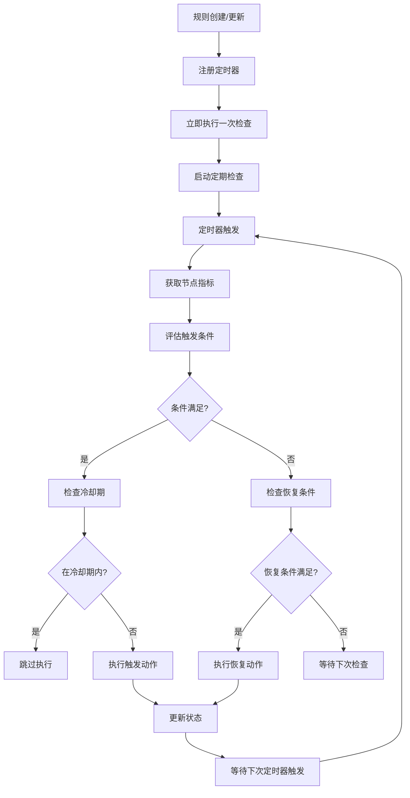

# 📘 NodeGuardian —— 事件驱动的Kubernetes节点自愈工具
> 基于CRD规则引擎 · 条件触发 · 动作执行 · 智能告警

---

## 📌 一、设计理念

**NodeGuardian** 采用**混合驱动**的CRD架构，通过声明式规则定义节点监控策略，实现：

✅ **规则驱动**：通过 `NodeGuardianRule` CRD 定义监控规则（集群级别）  
✅ **条件触发**：支持多条件组合，灵活定义触发逻辑  
✅ **动作执行**：支持多种处理动作（污点、告警、驱逐等）  
✅ **定期监控**：基于规则配置的 `checkInterval` 定期检查节点指标  
✅ **事件响应**：规则变化时立即生效，支持实时配置更新  
✅ **语义清晰**：CRD设计更符合Kubernetes原生语义  
✅ **集群范围**：资源定义在集群级别，作用于整个集群的节点  

---

## 📌 二、CRD架构设计

### 🔧 核心CRD：`NodeGuardianRule`（集群级别资源）

```yaml
apiVersion: apiextensions.k8s.io/v1
kind: CustomResourceDefinition
metadata:
  name: nodeguardianrules.nodeguardian.k8s.io
spec:
  group: nodeguardian.k8s.io
  scope: Cluster  # 集群级别资源
  versions:
    - name: v1
      served: true
      storage: true
      schema:
        openAPIV3Schema:
          type: object
          properties:
            spec:
              type: object
              required: ["conditions", "nodeSelector", "actions"]
              properties:
                # 1. 触发条件（支持多条件组合）
                conditions:
                  type: array
                  items:
                    type: object
                    required: ["metric", "operator", "value"]
                    properties:
                      metric:
                        type: string
                        enum: ["cpuUtilizationPercent", "cpuLoadRatio", "memoryUtilizationPercent", "diskUtilizationPercent"]
                        description: "监控指标类型"
                      operator:
                        type: string
                        enum: ["GreaterThan", "LessThan", "EqualTo", "NotEqualTo", "GreaterThanOrEqual", "LessThanOrEqual"]
                        description: "比较操作符"
                      value:
                        type: number
                        description: "阈值数值"
                      duration:
                        type: string
                        default: "5m"
                        description: "持续时间（如5m, 10m）"
                      description:
                        type: string
                        description: "条件描述"

                # 2. 条件组合逻辑
                conditionLogic:
                  type: string
                  enum: ["AND", "OR"]
                  default: "AND"
                  description: "多条件组合逻辑"

                # 3. 目标节点选择器
                nodeSelector:
                  type: object
                  properties:
                    matchLabels:
                      type: object
                      additionalProperties:
                        type: string
                    matchExpressions:
                      type: array
                      items:
                        type: object
                        properties:
                          key:
                            type: string
                          operator:
                            type: string
                            enum: ["In", "NotIn", "Exists", "DoesNotExist", "Gt", "Lt"]
                          values:
                            type: array
                            items:
                              type: string
                    nodeNames:
                      type: array
                      items:
                        type: string

                # 4. 执行动作
                actions:
                  type: array
                  items:
                    type: object
                    required: ["type"]
                    properties:
                      type:
                        type: string
                        enum: ["taint", "alert", "evict", "drain", "label", "annotation"]
                        description: "动作类型"
                      # 污点动作配置
                      taint:
                        type: object
                        properties:
                          key:
                            type: string
                            default: "nodeguardian/rule-triggered"
                          value:
                            type: string
                            default: "true"
                          effect:
                            type: string
                            enum: ["NoSchedule", "PreferNoSchedule", "NoExecute"]
                            default: "NoSchedule"
                      # 告警动作配置
                      alert:
                        type: object
                        properties:
                          enabled:
                            type: boolean
                            default: true
                          template:
                            type: string
                            description: "告警模板名称"
                          channels:
                            type: array
                            items:
                              type: string
                            description: "告警渠道（log, webhook, email等）"
                      # 驱逐动作配置
                      evict:
                        type: object
                        properties:
                          maxPods:
                            type: integer
                            default: 10
                            description: "最大驱逐Pod数量"
                          excludeNamespaces:
                            type: array
                            items:
                              type: string
                            default: ["kube-system", "kube-public"]
                      # 标签动作配置
                      label:
                        type: object
                        properties:
                          labels:
                            type: object
                            additionalProperties:
                              type: string
                      # 注解动作配置
                      annotation:
                        type: object
                        properties:
                          annotations:
                            type: object
                            additionalProperties:
                              type: string

                # 5. 恢复条件
                recoveryConditions:
                  type: array
                  items:
                    type: object
                    properties:
                      metric:
                        type: string
                      operator:
                        type: string
                      value:
                        type: number
                      duration:
                        type: string
                        default: "5m"

                # 6. 恢复动作
                recoveryActions:
                  type: array
                  items:
                    type: object
                    properties:
                      type:
                        type: string
                        enum: ["removeTaint", "removeLabel", "removeAnnotation", "alert"]
                      taint:
                        type: object
                        properties:
                          key:
                            type: string
                      label:
                        type: object
                        properties:
                          keys:
                            type: array
                            items:
                              type: string
                      annotation:
                        type: object
                        properties:
                          keys:
                            type: array
                            items:
                              type: string

                # 7. 监控配置
                monitoring:
                  type: object
                  properties:
                    checkInterval:
                      type: string
                      default: "60s"
                      description: "检查间隔"
                    metricsSource:
                      type: object
                      properties:
                        prometheusURL:
                          type: string
                        useMetricsServer:
                          type: boolean
                          default: false
                    cooldownPeriod:
                      type: string
                      default: "5m"
                      description: "冷却期，避免频繁触发"

                # 8. 规则元数据
                metadata:
                  type: object
                  properties:
                    priority:
                      type: integer
                      default: 100
                      description: "规则优先级，数字越小优先级越高"
                    enabled:
                      type: boolean
                      default: true
                    description:
                      type: string
                      description: "规则描述"
                    tags:
                      type: array
                      items:
                        type: string
                      description: "规则标签"

            status:
              type: object
              properties:
                phase:
                  type: string
                  enum: ["Active", "Inactive", "Error"]
                lastTriggered:
                  type: string
                  format: date-time
                triggeredNodes:
                  type: array
                  items:
                    type: string
                lastError:
                  type: string
                conditions:
                  type: array
                  items:
                    type: object
                    properties:
                      type:
                        type: string
                      status:
                        type: string
                        enum: ["True", "False", "Unknown"]
                      lastTransitionTime:
                        type: string
                        format: date-time
                      reason:
                        type: string
                      message:
                        type: string
```

---

## 📌 三、CRD使用示例

### 🎯 示例1：高负载节点隔离规则

```yaml
apiVersion: nodeguardian.k8s.io/v1
kind: NodeGuardianRule
metadata:
  name: high-load-isolation
spec:
  # 触发条件：CPU负载率 > 1.5 且 内存使用率 > 90%
  conditions:
    - metric: "cpuLoadRatio"
      operator: "GreaterThan"
      value: 1.5
      duration: "3m"
      description: "CPU负载率超过1.5倍核数"
    - metric: "memoryUtilizationPercent"
      operator: "GreaterThan"
      value: 90
      duration: "2m"
      description: "内存使用率超过90%"
  
  conditionLogic: "AND"  # 两个条件都满足才触发
  
  # 目标节点：所有worker节点
  nodeSelector:
    matchLabels:
      node-role.kubernetes.io/worker: "true"
  
  # 执行动作：打污点 + 发送告警
  actions:
    - type: "taint"
      taint:
        key: "nodeguardian/high-load"
        value: "true"
        effect: "NoSchedule"
    - type: "alert"
      alert:
        enabled: true
        template: "high-load-alert"
        channels: ["webhook", "email"]
    - type: "label"
      label:
        labels:
          nodeguardian.io/status: "high-load"
          nodeguardian.io/triggered-at: "{{ .timestamp }}"
  
  # 恢复条件：CPU负载率 < 0.8 且 内存使用率 < 70%
  recoveryConditions:
    - metric: "cpuLoadRatio"
      operator: "LessThan"
      value: 0.8
      duration: "5m"
    - metric: "memoryUtilizationPercent"
      operator: "LessThan"
      value: 70
      duration: "3m"
  
  # 恢复动作：移除污点和标签
  recoveryActions:
    - type: "removeTaint"
      taint:
        key: "nodeguardian/high-load"
    - type: "removeLabel"
      label:
        keys: ["nodeguardian.io/status", "nodeguardian.io/triggered-at"]
    - type: "alert"
      alert:
        template: "recovery-alert"
        channels: ["log", "email"]
  
  # 监控配置
  monitoring:
    checkInterval: "30s"
    metricsSource:
      prometheusURL: "http://prometheus-k8s.monitoring.svc:9090"
    cooldownPeriod: "10m"
  
  # 规则元数据
  metadata:
    priority: 100
    enabled: true
    description: "高负载节点自动隔离规则"
    tags: ["production", "critical"]
```

### 🎯 示例2：磁盘空间告警规则

```yaml
apiVersion: nodeguardian.k8s.io/v1
kind: NodeGuardianRule
metadata:
  name: disk-space-alert
spec:
  conditions:
    - metric: "diskUtilizationPercent"
      operator: "GreaterThan"
      value: 85
      duration: "1m"
      description: "磁盘使用率超过85%"
  
  nodeSelector:
    matchLabels:
      node-role.kubernetes.io/worker: "true"
  
  actions:
    - type: "alert"
      alert:
        enabled: true
        template: "disk-space-alert"
        channels: ["webhook", "email"]
    - type: "annotation"
      annotation:
        annotations:
          nodeguardian.io/disk-warning: "true"
          nodeguardian.io/disk-warning-time: "{{ .timestamp }}"
  
  recoveryConditions:
    - metric: "diskUtilizationPercent"
      operator: "LessThan"
      value: 80
      duration: "2m"
  
  recoveryActions:
    - type: "removeAnnotation"
      annotation:
        keys: ["nodeguardian.io/disk-warning", "nodeguardian.io/disk-warning-time"]
  
  monitoring:
    checkInterval: "60s"
    cooldownPeriod: "5m"
  
  metadata:
    priority: 200
    description: "磁盘空间告警规则"
    tags: ["storage", "warning"]
```

### 🎯 示例3：紧急驱逐规则

```yaml
apiVersion: nodeguardian.k8s.io/v1
kind: NodeGuardianRule
metadata:
  name: emergency-eviction
spec:
  conditions:
    - metric: "memoryUtilizationPercent"
      operator: "GreaterThan"
      value: 95
      duration: "30s"
      description: "内存使用率超过95%，紧急情况"
  
  nodeSelector:
    matchLabels:
      node-role.kubernetes.io/worker: "true"
  
  actions:
    - type: "taint"
      taint:
        key: "nodeguardian/emergency"
        value: "true"
        effect: "NoExecute"
    - type: "evict"
      evict:
        maxPods: 5
        excludeNamespaces: ["kube-system", "kube-public", "monitoring"]
    - type: "alert"
      alert:
        enabled: true
        template: "emergency-alert"
        channels: ["webhook", "email"]
  
  recoveryConditions:
    - metric: "memoryUtilizationPercent"
      operator: "LessThan"
      value: 80
      duration: "2m"
  
  recoveryActions:
    - type: "removeTaint"
      taint:
        key: "nodeguardian/emergency"
    - type: "alert"
      alert:
        template: "emergency-recovery-alert"
        channels: ["log", "email"]
  
  monitoring:
    checkInterval: "15s"
    cooldownPeriod: "30m"
  
  metadata:
    priority: 50  # 高优先级
    description: "紧急内存不足驱逐规则"
    tags: ["emergency", "critical", "eviction"]
```

---

## 📌 四、告警模板定义

### 📧 告警模板CRD：`AlertTemplate`（集群级别资源）

```yaml
apiVersion: apiextensions.k8s.io/v1
kind: CustomResourceDefinition
metadata:
  name: alerttemplates.nodeguardian.k8s.io
spec:
  group: nodeguardian.k8s.io
  scope: Cluster  # 集群级别资源
  versions:
    - name: v1
      served: true
      storage: true
      schema:
        openAPIV3Schema:
          type: object
          properties:
            spec:
              type: object
              required: ["subject", "body"]
              properties:
                subject:
                  type: string
                  description: "告警主题模板"
                body:
                  type: string
                  description: "告警内容模板"
                channels:
                  type: array
                  items:
                    type: string
                  description: "支持的告警渠道"
                variables:
                  type: object
                  description: "模板变量定义"
```

### 📧 告警模板示例

```yaml
apiVersion: nodeguardian.k8s.io/v1
kind: AlertTemplate
metadata:
  name: high-load-alert
spec:
  subject: "[NodeGuardian] 节点 {{ .nodeName }} 高负载告警"
  body: |
    节点 {{ .nodeName }} 触发高负载规则：
    
    当前指标：
    - CPU负载率: {{ .metrics.cpuLoadRatio }}
    - 内存使用率: {{ .metrics.memoryUtilizationPercent }}%
    - 检查时间: {{ .timestamp }}
    
    已执行动作：
    {{ range .actions }}
    - {{ .type }}: {{ .description }}
    {{ end }}
    
    问题Pod列表：
    {{ range .topPods }}
    - {{ .name }} ({{ .namespace }}): CPU {{ .cpu }}, MEM {{ .memory }}
    {{ end }}
    
    请及时处理。
  channels: ["webhook", "email"]
  variables:
    nodeName: "string"
    metrics: "object"
    actions: "array"
    topPods: "array"
    timestamp: "string"
```

---

## 📌 五、Controller架构

### 🏗️ 混合驱动架构（事件驱动 + 定期监控）

```
┌─────────────────┐    ┌──────────────────┐    ┌─────────────────┐
│ NodeGuardianRule│    │   Controller     │    │   Node Metrics  │
│     CRD         │───▶│   (Python)       │◀───│  (Prometheus)   │
└─────────────────┘    └─────────┬────────┘    └─────────────────┘
         │                       │                       │
         │ 事件监听               │ 定期轮询               │
         │ (ADDED/MODIFIED)      │ (checkInterval)       │
         ▼                       ▼                       ▼
┌─────────────────┐    ┌──────────────────┐    ┌─────────────────┐
│  Rule Manager   │    │  Timer Manager   │    │ Metrics Collector│
│  - 规则注册     │    │  - 定时器管理    │    │  - 指标获取     │
│  - 规则更新     │    │  - 间隔控制      │    │  - 数据缓存     │
│  - 规则删除     │    │  - 并发控制      │    │  - 错误处理     │
└─────────┬───────┘    └─────────┬────────┘    └─────────┬───────┘
          │                      │                       │
          └──────────────────────┼───────────────────────┘
                                 ▼
                    ┌─────────────────────────┐
                    │    Rule Engine          │
                    │  - 条件评估             │
                    │  - 动作执行             │
                    │  - 状态管理             │
                    │  - 冷却期控制           │
                    └─────────┬───────────────┘
                              │
                              ▼
                    ┌─────────────────────────┐
                    │    Action Executors     │
                    │  - Taint Manager        │
                    │  - Alert Manager        │
                    │  - Eviction Manager     │
                    │  - Recovery Manager     │
                    └─────────────────────────┘
```

### 🔄 处理流程

#### 📡 事件驱动流程（规则变化时）
1. **规则监听**：Controller监听`NodeGuardianRule` CRD变化
2. **规则注册**：新规则创建时注册到定时器管理器
3. **立即执行**：规则变化时立即执行一次检查
4. **定时器启动**：根据规则的`checkInterval`启动定期检查

#### ⏰ 定期监控流程（持续运行）
1. **定时触发**：每个规则按配置的`checkInterval`定期触发
2. **指标收集**：从Prometheus/Metrics Server收集节点指标
3. **条件评估**：根据规则中的条件评估每个节点状态
4. **冷却期检查**：检查是否在冷却期内，避免频繁触发
5. **动作执行**：满足条件时执行相应动作
6. **状态更新**：更新CRD的status字段
7. **恢复检测**：检测恢复条件并执行恢复动作

#### 🔧 核心特性
- **双重驱动**：事件驱动确保配置实时生效，定期监控确保持续检查
- **独立定时器**：每个规则有独立的检查间隔和冷却期
- **并发控制**：支持多个规则并发执行，避免资源竞争
- **故障恢复**：规则删除时自动清理定时器，避免资源泄漏

---

## 📌 六、定期检查机制详解

### 🎯 设计目标

NodeGuardian 的核心价值在于**持续监控**节点状态，而不是仅在规则变化时检查一次。因此采用**混合驱动架构**：

- **事件驱动**：确保规则配置变化时立即生效
- **定期监控**：确保持续检查节点指标，及时发现异常

### ⚙️ 实现机制

#### 1. 规则生命周期管理

```python
class NodeGuardianController:
    def __init__(self):
        self.active_rules = {}      # 存储活跃规则
        self.rule_timers = {}       # 存储每个规则的定时器
        self.rule_lock = threading.Lock()  # 线程安全
```

#### 2. 定时器管理

每个规则创建时，根据其 `checkInterval` 配置启动独立的定时器：

```yaml
# 示例：CPU监控规则
monitoring:
  checkInterval: "30s"    # 每30秒检查一次
  cooldownPeriod: "5m"    # 冷却期5分钟
  maxRetries: 3           # 最大重试次数
```

#### 3. 检查流程



### 🔧 关键特性

#### 1. 独立定时器
- 每个规则有独立的检查间隔
- 支持不同规则使用不同的检查频率
- 规则删除时自动清理定时器

#### 2. 冷却期控制
- 避免频繁触发相同动作
- 可配置的冷却期时间
- 支持不同动作使用不同冷却期

#### 3. 并发安全
- 使用线程锁保护共享资源
- 支持多个规则并发执行
- 避免资源竞争和死锁

#### 4. 故障恢复
- 规则删除时自动清理资源
- 定时器异常时自动重启
- 支持优雅关闭和重启

### 📊 性能考虑

#### 1. 资源优化
- 指标数据缓存，避免重复查询
- 批量处理节点检查
- 智能重试机制

#### 2. 可扩展性
- 支持大量规则并发运行
- 可配置的最大并发数
- 动态调整检查频率

#### 3. 监控指标
- 规则执行统计
- 检查成功率
- 平均响应时间

---

## 📌 七、部署和使用

### 🚀 部署步骤

```bash
# 1. 创建CRD
kubectl apply -f nodeguardianrule-crd.yaml
kubectl apply -f alerttemplate-crd.yaml

# 2. 部署Controller
kubectl apply -f nodeguardian-controller.yaml

# 3. 创建告警模板
kubectl apply -f alert-templates.yaml

# 4. 创建监控规则
kubectl apply -f nodeguardian-rules.yaml

# 5. 查看规则状态
kubectl get nodeguardianrules
kubectl describe nodeguardianrule high-load-isolation
```

### 📊 状态监控

```bash
# 查看所有规则状态
kubectl get nodeguardianrules -o wide

# 查看特定规则详情
kubectl describe nodeguardianrule high-load-isolation

# 查看规则事件
kubectl get events --field-selector involvedObject.kind=NodeGuardianRule
```

---

## 🎉 总结

**混合驱动**的CRD设计使NodeGuardian更加：

- **持续监控**：通过定期检查机制确保持续监控节点状态，不依赖规则变化
- **实时响应**：事件驱动确保规则配置变化时立即生效
- **语义清晰**：每个CRD都有明确的职责和含义
- **易于理解**：规则定义直观，符合运维人员思维
- **高度灵活**：支持复杂的条件组合和动作配置
- **K8s原生**：完全符合Kubernetes的设计理念
- **生产就绪**：支持多租户、优先级、状态管理等企业级特性

### 🔑 核心价值

NodeGuardian 的核心价值在于解决了传统监控工具的痛点：

1. **真正的持续监控**：不是仅在配置变化时检查，而是按规则配置的间隔持续检查
2. **智能冷却期**：避免频繁触发，减少告警风暴
3. **自动恢复**：支持恢复条件检测和自动恢复动作
4. **资源隔离**：每个规则独立运行，互不影响

这种设计让NodeGuardian真正成为一个"智能节点守护者"，而不仅仅是一个简单的监控工具。
